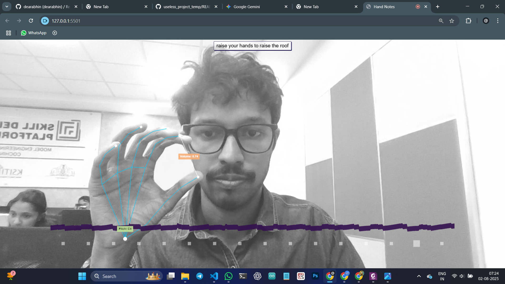
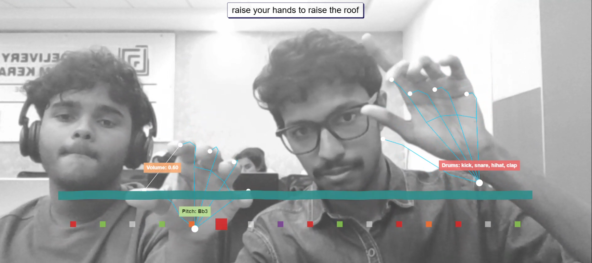
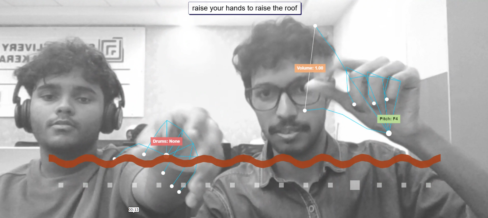
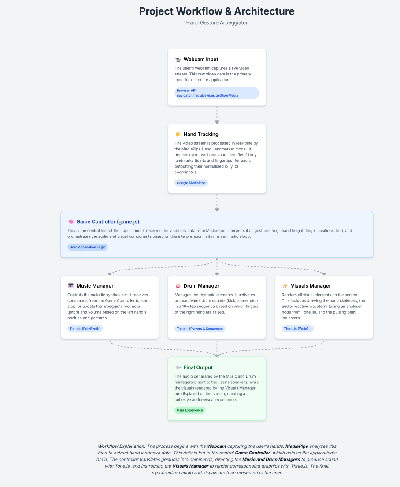

# Hand Notes 🎯

Website - https://dearabhin.github.io/Hand-Notes/ (Desktop/Mobile)


## Basic Details
### Team Name: Coconut 🥥

### Team Members
- Team Lead: Abhin Krishna - Model Engineering College
- Member 2: Anand Sabu - Model Engineering College

### Project Description
An interactive web application that transforms your hand gestures into a real-time musical performance. Control music note controller with one hand, a drum machine with the other, and watch as the visuals react to the music you create.

### The Problem (that doesn't exist)
The deafening silence of our rooms has become unbearable. Traditional musical instruments require years of practice and, frankly, too much sitting. We needed a way to create sick beats and ethereal melodies simply by waving our hands in the air, because who has time to learn chords or we are so much useless in music ,now music produced is accidental and cool?

### The Solution (that nobody asked for)
We have engineered a revolutionary solution that turns your webcam into a gesture-controlled music studio. Raise your hands to raise the roof, literally. Now you can conduct an entire orchestra from the comfort of your desk, no talent required!

## Technical Details
### Technologies/Components Used
For Software:
- **Languages:** JavaScript, HTML5, CSS
- **Frameworks/Libraries:**
    - **Three.js:** For all 3D rendering, including the hand skeletons, beat indicators, and the audio-reactive waveform.
    - **MediaPipe:** For real-time hand tracking ML and gesture recognition from the webcam feed.
    - **Tone.js:** For generating all synthesizer sounds, scheduling arpeggios, and managing the drum machine sequence.
- **Tools:**
    - A modern web browser with WebGL support
    - A code editor (e.g., VS Code)
    - A local web server (e.g., Python's http.server)

For Hardware:
- **Main Components:** A standard computer webcam.
- **Specifications:** Any webcam capable of streaming video to the browser.
- **Tools Required:** None.

### Implementation
For Software:
# Installation
```bash
# Clone this repository
git clone https://github.com/dearabhin/Hand-Notes.git

# Navigate to the project directory
cd Hand-Notes

# Run

```bash
# Clone this repository
git clone https://github.com/dearabhin/Hand-Notes.git

# Navigate to the project directory
cd Hand-Notes

# Serve with your preferred method (example using Python)
python -m http.server
```

Then navigate to `http://localhost:8000` in your browser.


# Screenshots





# Diagrams



### Project Demos
# Video

[](https://youtu.be/czOtJNIJyIM)

or

https://youtu.be/czOtJNIJyIM

## Team Contributions
- Abhin Krishna - Model Engineering College: ML and Web Development
- Anand Sabu - Model Model Engineering College: Web Developement

---
Made with ❤️ at TinkerHub Useless Projects 


