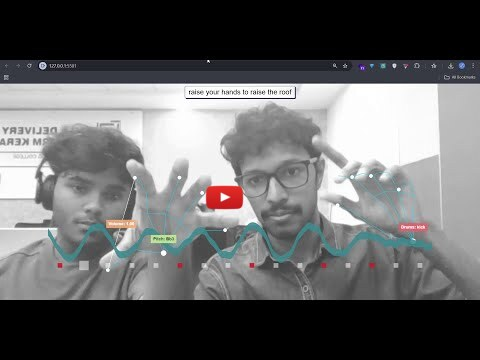

# 🎶🪇🥁 Hand Notes 🥁🪇🎶 Hand-Controlled Music Synthesizer

👉 Try it out here - https://dearabhin.github.io/Hand-Notes/ (Desktop/Mobile)


## Basic Details
### Team Name: Coconut 🥥

### Team Members
- Team Lead: Abhin Krishna - Model Engineering College
- Member 2: Anand Sabu - Model Engineering College

### Project Description
An interactive web application that transforms your hand gestures into a real-time musical performance. Control music note controller with one hand, a drum machine with the other, and watch as the visuals react to the music you create.

### The Problem (that doesn't exist)
The deafening silence of our rooms has become unbearable. Traditional musical instruments require years of practice and, frankly, too much sitting. We needed a way to create sick beats and ethereal melodies simply by waving our hands in the air, because who has time to learn chords or we are so much useless in music ,now music produced is accidental and cool?

### The Solution (that nobody asked for)
We have engineered a revolutionary solution that turns your webcam into a gesture-controlled music studio. Raise your hands to raise the roof, literally. Now you can conduct an entire orchestra from the comfort of your desk, no talent required!

# 🎵 How to Use! 🎵

Ready to create music just by waving your hands? This short guide will show you how to become a digital maestro in minutes.

---

## Step 1: Getting Started

**Open the Website:**  
Make sure you're using a modern web browser like Chrome or Firefox on a desktop or mobile device. 👉 [**Open the website**](https://dearabhin.github.io/Hand-Notes/)


**Allow Camera Access:**  
The app will ask for permission to use your webcam. Please click **"Allow"**. This is essential for tracking your hands!

**Position Yourself:**  
For the best results, sit in a well-lit area with a simple background behind you. Make sure your hands are clearly visible to the camera.

---

## Step 2: Making Music with Your Hands

The application tracks both of your hands. Each hand has a special job.

---

### **Your Left Hand: The Melody Maker 🎹**

Your left hand controls the synthesizer arpeggio (a sequence of notes).

- **Change Pitch:** Raise or lower your entire hand in the camera's view.  
  - Higher Hand = Higher Pitch  
  - Lower Hand = Lower Pitch  

- **Control Volume:** Use your thumb and index finger.  
  - Fingers Apart = Louder Volume  
  - Pinch Fingers Together = Softer Volume  

- **Change Synth Sound:** Make a fist with your left hand to cycle through different instrument sounds. Try it out to find your favorite!

---

### **Your Right Hand: The Drummer 🥁**

Your right hand controls the drum machine. Raise individual fingers to add different drum sounds to the beat.

- **Index Finger Up:** Activates the Kick Drum (the deep "boom" sound).  
- **Middle Finger Up:** Activates the Snare Drum (the sharp "crack" sound).  
- **Ring Finger Up:** Activates the Hi-Hat (the rhythmic "tss" sound).  
- **Pinky Finger Up:** Activates the Clap sound.

You can combine them! Try raising your index and ring fingers at the same time to get a classic kick and hi-hat beat.

---

## Step 3: Have Fun!

That's it! You're ready to start creating.

---

Enjoy the magic of making music with just a wave of your hand! ✨


## Technical Details
### Technologies/Components Used
For Software:
- **Languages:** JavaScript, HTML5, CSS
- **Frameworks/Libraries:**
    - **Three.js:** For all 3D rendering, including the hand skeletons, beat indicators, and the audio-reactive waveform.
    - **MediaPipe:** For real-time hand tracking ML and gesture recognition from the webcam feed.
    - **Tone.js:** For generating all synthesizer sounds, scheduling arpeggios, and managing the drum machine sequence.
- **Tools:**
    - A modern web browser with WebGL support
    - A code editor (e.g., VS Code)
    - A local web server (e.g., Python's http.server)

For Hardware:
- **Main Components:** A standard computer webcam.
- **Specifications:** Any webcam capable of streaming video to the browser.
- **Tools Required:** None.

### Implementation
For Software:
# Installation

```bash
# Clone this repository
git clone https://github.com/dearabhin/Hand-Notes.git

# Navigate to the project directory
cd Hand-Notes

# Serve with your preferred method (example using Python)
python -m http.server
```

Then navigate to `http://localhost:8000` in your browser.


# Screenshots
<p align="center">
  <br>
  <em>Figure 1: The main interface of the Hand Notes, showing both hands being tracked in real-time. The application provides visual feedback with skeletal overlays and labels for each hand's function, set against an audio-reactive background.</em>
</p>

<p align="center">
  <br>
  <em>Figure 2: A closer look at the left hand, which controls the melody. The vertical position of the hand determines the musical pitch, while the distance between the thumb and index finger adjusts the volume, as indicated by the dynamic labels.</em>
</p>

<p align="center">
  <br>
  <em>Figure 3: The right hand acts as the drum machine controller. Raising individual fingers activates different percussive elements like the kick, snare, and hi-hat. The label above the hand updates in real-time to show which drum parts are currently active in the sequence.</em>
</p>


# Diagrams


### Project Demos
# Video

Watch demo video on YouTube: https://youtu.be/czOtJNIJyIM

<a href="https://www.youtube.com/watch?v=czOtJNIJyIM">
  
</a>


## Team Contributions
- Abhin Krishna - Model Engineering College: ML and Web Development
- Anand Sabu - Model Model Engineering College: Web Developement

---
Made with ❤️ at TinkerHub Useless Projects 


